# chunk — Audio Chunking



Splits a `.wav` file into smaller segments based on a YAML configuration defining time boundaries. Useful for pre-processing long recordings before running `extract`.

!!! note
    Only `.wav` input files are supported. Output chunks are also `.wav`.

## CLI

```bash
speech-mine chunk <audio.wav> <config.yaml> <output_dir/> [options]
```

### Options

| Flag | Default | Description |
|------|---------|-------------|
| `--fade-in MS` | `0` | Fade in duration in milliseconds |
| `--fade-out MS` | `0` | Fade out duration in milliseconds |
| `--padding MS` | `0` | Silence padding added to both ends (ms) |
| `--verbose` | — | Print file sizes for each chunk |

### Examples

```bash
# Basic chunking
speech-mine chunk recording.wav config.yaml chunks/

# With fade effects and padding
speech-mine chunk recording.wav config.yaml chunks/ \
  --fade-in 500 \
  --fade-out 500 \
  --padding 100 \
  --verbose
```

## Library

The `config` argument accepts either a path to a YAML file or a list of chunk dicts directly.

```python
from speech_mine.pickaxe.chunk import chunk_audio_file, AudioChunker

# From a YAML file
output_files = chunk_audio_file(
    audio_path="recording.wav",
    config="config.yaml",
    output_dir="chunks/",
    fade_in=500,
    fade_out=500,
    silence_padding=100,
)

# Programmatically — no YAML file needed
output_files = chunk_audio_file(
    audio_path="recording.wav",
    config=[
        {"start": 0.0, "end": 30.0, "name": "intro"},
        {"start": 30.0, "end": 120.0, "name": "discussion"},
        {"start": 120.0, "end": 300.0},
    ],
    output_dir="chunks/",
)

# Or use the class directly
chunker = AudioChunker(fade_in_duration=500, fade_out_duration=500, silence_padding=100)
chunker.process_audio_file("recording.wav", "config.yaml", "chunks/")
chunker.process_audio_file("recording.wav", [{"start": 0.0, "end": 30.0}], "chunks/")
```

## YAML config format

See [examples/example_chunk_config.yaml](https://github.com/BeckettFrey/speech-mine/blob/main/examples/example_chunk_config.yaml) for a full example.

```yaml
chunks:
  - start: 0.0
    end: 30.0
    name: "intro"        # optional — included in output filename
  - start: 30.0
    end: 120.0
    name: "discussion"
  - start: 120.0
    end: 300.0
    # no name — output will be "2.wav"
```

Output filenames follow the pattern `{index}.{name}.wav` or `{index}.wav` if no name is set. Chunks are sorted by start time before indexing.

Validation rules:

- `start` and `end` are required for every chunk
- `end` must be greater than `start`
- `end` cannot exceed the audio file duration
- Start times must be unique across chunks
